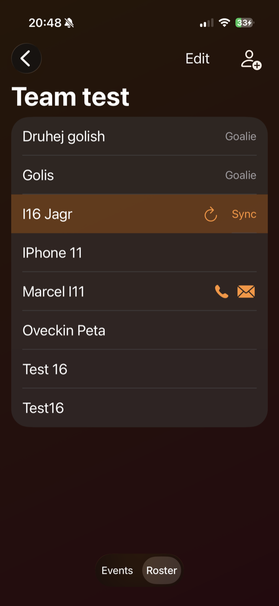
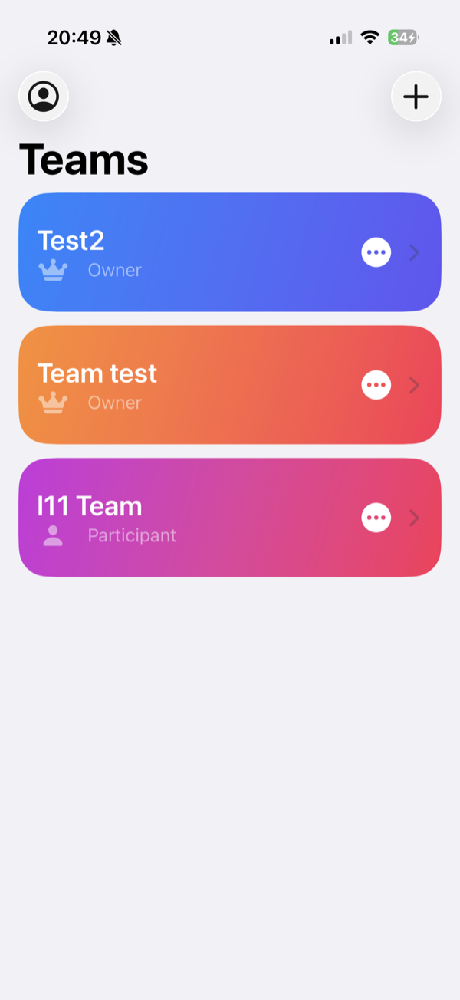
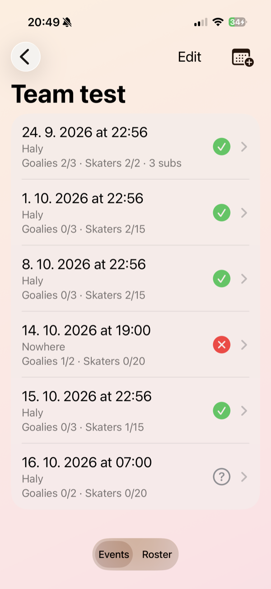

# IceTime 🏒

**Team management for amateur ice hockey, built entirely on SwiftUI and CloudKit.**

Create a team, invite your teammates through iCloud, schedule games and practices, and let everyone answer with one tap. IceTime builds the lineup for you: each event has its own goalie and skater limits, spots are first come, first served, and players over the limit become substitutes who move up automatically when someone drops out.

No backend, no accounts to create, no third-party dependencies: your team lives in your iCloud and is shared with your teammates using CloudKit sharing.

Built for the [ACoding Hackathon 2026](https://acoding.academy/hackaton26/).

<!-- Screenshots: add images to docs/screenshots/ and uncomment
<p align="center">
  
  
  
</p>
-->

## Features

- **Teams**: create as many teams as you like; each one is private until you share it.
- **Invites via iCloud**: share a team using the system share sheet (Messages, Mail, or a copied link). Teammates join with one tap, even when the app isn't running yet.
- **Roster**: players add themselves from their profile (name, goalie flag, phone, email). The owner can also add guests without an iPhone. Call or email a teammate straight from the roster.
- **Events**: one-off or recurring (daily or weekly, ending after N occurrences or on a date), each with its own goalie and skater limits, for example 2 + 20 for a practice or 1 + 10 for a game against another team.
- **One-tap RSVP**: answer *Going* or *Not going* directly from the event list. The owner can answer on behalf of guests.
- **Automatic lineup**: the event detail shows goalies, skaters, substitutes (highlighted), players who aren't going, and those who haven't answered yet.
- **Owner permissions**: only the team owner can share the team, add guests, and create, edit or delete events.

## How it works

### Architecture

The app follows a simple MVVM structure with one clear boundary for CloudKit:

```
Views (SwiftUI)  →  ViewModels (@Observable)  →  TeamRepository (protocol)  →  CloudKitTeamRepository
```

- **Models** (`Team`, `Player`, `Event`, `RSVP`, `Lineup`) are plain Swift structs with no CloudKit types.
- **`TeamRepository`** is the only place where CloudKit appears. View models only talk to the protocol, so they stay free of `CKRecord`, `CKError` and database details.
- CloudKit errors are translated to readable messages at the repository boundary (for example "You're offline", "Sign into iCloud").

### CloudKit data model

- **One record zone per team.** The owner's zone lives in their private database. Sharing the team shares the whole zone (`CKShare(recordZoneID:)`), so every record inside it (roster, events, RSVPs) is shared automatically without any parent/child bookkeeping. Teammates see the same zone in their shared database.
- **Team creation is always explicit.** Nothing is created automatically on launch, so a user can join someone else's team without accidentally becoming the owner of an empty one.
- **One RSVP per player per event, enforced by CloudKit itself.** CloudKit has no unique constraints, but record IDs are unique within a zone. Each RSVP's record name is built from the event and player IDs, so a second answer from the same player can only overwrite the first one, never duplicate it. RSVPs are saved with `savePolicy: .changedKeys`, which creates or overwrites the record in a single request without fetching it first.
- **Deleting an event also deletes its RSVPs** in one atomic `modifyRecords` call.

### Lineup and substitutes

The lineup is **never stored; it's always computed** from the roster, the RSVPs and the event's limits:

1. Players who answered *Going* are sorted by when they answered, using the server's `modificationDate`, which can't be affected by a wrong clock on someone's phone.
2. Goalies and skaters are split into two queues.
3. The first *N* in each queue are in the lineup; everyone after them is a substitute.

Because nothing is stored, promoting a substitute needs no extra code: when a player in the lineup switches to *Not going*, the next person in the queue moves up the next time the lineup is computed. Re-sending the same answer is ignored, so tapping *Going* again never moves a player to the back of the queue.

The lineup and recurrence logic is covered by unit tests (Swift Testing) in `IceTimeTests`.

## Native Apple APIs

- **SwiftUI** with the Observation framework (`@Observable`) and `NavigationStack`
- **CloudKit**: custom record zones, zone-wide `CKShare`, private and shared databases, `modifyRecords` batches with atomic deletes
- **Swift Concurrency**: `async`/`await` throughout, `async let` to load events and RSVPs in parallel
- **Swift Testing** (`@Test`, `#expect`, `#require`) for unit tests
- **`UICloudSharingController`** for the system invite UI, bridged with `UIViewControllerRepresentable` (no native SwiftUI equivalent exists)
- **Scene delegate bridge** for accepting shares on both warm and cold launch (`windowScene(_:userDidAcceptCloudKitShareWith:)` and `connectionOptions.cloudKitShareMetadata`)
- `Link` with `tel:` and `mailto:` URLs, SF Symbols, and accessibility labels for icon-only controls

No third-party dependencies.

## Running it yourself

**Requirements:** Xcode 26, iOS 26, an Apple Developer account (required for CloudKit), and an iCloud account on the device or simulator.

The project uses the author's CloudKit container, which is tied to their developer team. To run it with your own:

1. Open `IceTime.xcodeproj`. In **Signing & Capabilities**, select your team and change the bundle identifier (for example `com.yourname.IceTime`).
2. In the **iCloud** capability, replace the container `iCloud.com.marcel.IceTime` with your own (for example `iCloud.com.yourname.IceTime`), and update `CloudKitTeamRepository.containerID` to match.
3. Run the app and create a team, a player, an event and an RSVP. In the Development environment, CloudKit creates the record types automatically on first save.
4. In the [CloudKit Console](https://icloud.developer.apple.com/), go to your container → **Schema → Indexes** and add a **Queryable** index on `recordName` for the record types that are queried: `Player`, `Event` and `RSVP`. Without it, loading lists fails with *"Field 'recordName' is not marked queryable"*.

**Testing sharing** needs two different Apple IDs, and the accepting side must be a **real device**: the iOS Simulator can't accept CloudKit share links. The simulator works fine as the owner (create a team, share it, copy the link).

## Project structure

```
IceTime/
├── Models/        Plain structs: Team, Player, Event, RSVP, Lineup, Profile
├── Repository/    TeamRepository protocol and its CloudKit implementation
├── ViewModels/    @Observable view models, one per screen or feature
├── Views/         SwiftUI screens, sheets and small reusable views
└── AppDelegate.swift   Scene delegate bridge for accepting CloudKit shares
IceTimeTests/      Unit tests for the lineup and recurrence logic
```

## Known limitations

- **Permissions are enforced by the app, not by the server.** CloudKit share permissions apply to the whole zone, and teammates need write access to answer RSVPs and join the roster. "Only the owner can manage events" is therefore enforced in the UI and the repository layer.
- **No offline mode.** Data is loaded from iCloud each time; without a connection the app shows an error instead of cached data.
- **Push notifications for RSVP changes are not implemented yet.** They're planned using `CKDatabaseSubscription` (the shared database doesn't support query subscriptions), silent push and local notifications.
